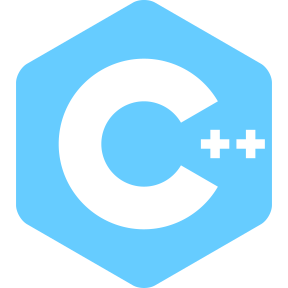
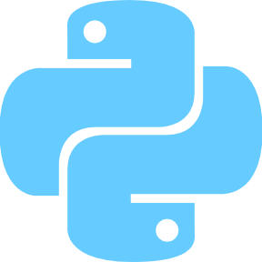
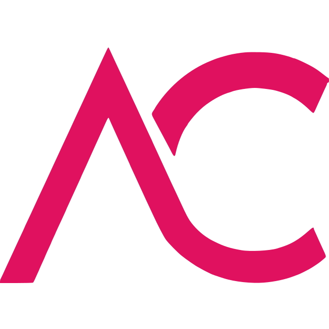

 <b>¤ Languages ¤</b> 

  
  
  
  
  
  
  

<!--

 <b>¤ Learning ¤</b> 

  

  
  
  
  
  
  
  
  
  
  
  
  
  
  
-->

 <b>¤ Competitive Programming ¤</b> 

<!--
  
  
  
  
  
  
  
  
  
  
-->

 <b>¤ Socials ¤</b> 

  
  

<!--
  
  
  
  
  
  
  
  
  
-->

  

<!--
### Hi there 👋

**spookymath/spookymath** is a ✨ _special_ ✨ repository because its `README.md` (this file) appears on your GitHub profile.

Here are some ideas to get you started:

- 🔭 I’m currently working on ...
- 🌱 I’m currently learning ...
- 👯 I’m looking to collaborate on ...
- 🤔 I’m looking for help with ...
- 💬 Ask me about ...
- 📫 How to reach me: ...
- 😄 Pronouns: ...
- ⚡ Fun fact: ...
-->
