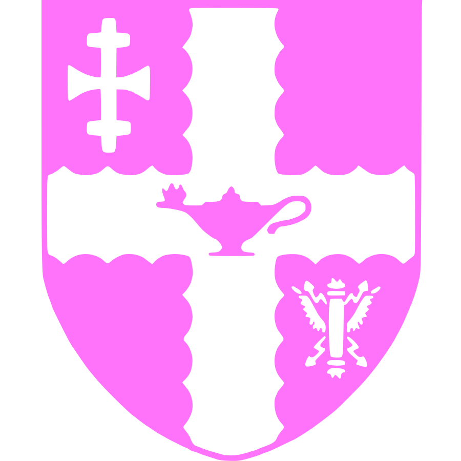

<table border="0" style="width:100%">
 <tr>
    <td>

• Junior Quant at [XTX Markets](https://www.xtxmarkets.com/)            

**Education**  
• Master's Degree - Computer Science at [ETH Zurich](https://ethz.ch/en.html/)
 
• Bachelor's Degree - Mathematics at [University of Warwick](https://warwick.ac.uk/)

**Experience**  
• Algorithm Engineer Intern at [Huawei](https://www.huawei.com/en/)
 
• Undergraduate Researcher at [EPFL](https://www.epfl.ch/en/)
 
• Undergraduate Researcher at [TU-Delft](https://www.tudelft.nl/en/)
 
• Game Mathematician Intern at [Entain](https://entaingroup.com/)

**Volunteering**  
• Teaching Assistant at [University of Warwick](https://warwick.ac.uk/)
 
• Game Data Miner at [Unite-DB](https://unite-db.com/) and [OP.gg](https://www.op.gg/)
   
   <td>
    

 

     

     

 

 

    
   <td>
    

 

     

     

 

 

    
   <td>

• Competitions Master on [Kaggle](https://www.kaggle.com/smartstudsai/)

**Competitive Programming**  
• International Master **~(2300+)** on [Codeforces](https://codeforces.com/profile/smartstudsai/)
 
• 6-star Rated **~(2400+)** on [Codechef](https://www.codechef.com/users/smartstudsai/)
 
• Guardian Rated **~(2400+)** on [Leetcode](https://leetcode.com/smartstudsai/)
 
• Red Rated **~(2200+)** on [Topcoder]( https://www.topcoder.com/members/smartstudsai/) 
 
• 4-Dan / Orange Rated **~(2600+)** on [Atcoder](https://atcoder.jp/users/smartstudsai/)
    
**Chess**  
• **~(2100+)** on [Chess.com]( https://www.topcoder.com/members/smartstudsai/)
 
• **~(2100+)** on [Lichess]( https://www.topcoder.com/members/smartstudsai/) 
 

**Other Links**  

         
 

 
  </td>
  
  
 </tr>
</table>

• Junior Quant at [XTX Markets](https://www.xtxmarkets.com/)            

**Education**  
• Master's Degree - Computer Science at [ETH Zurich](https://ethz.ch/en.html/)
 
• Bachelor's Degree - Mathematics at [University of Warwick](https://warwick.ac.uk/)

**Experience**  
• Algorithm Engineer Intern at [Huawei](https://www.huawei.com/en/)
 
• Undergraduate Researcher at [EPFL](https://www.epfl.ch/en/)
 
• Undergraduate Researcher at [TU-Delft](https://www.tudelft.nl/en/)
 
• Game Mathematician Intern at [Entain](https://entaingroup.com/)

**Volunteering**  
• Teaching Assistant at [University of Warwick](https://warwick.ac.uk/)
 
• Game Data Miner at [Unite-DB](https://unite-db.com/) and [OP.gg](https://www.op.gg/)

**Profiles** - [Kaggle][kg]&nbsp; [Leetcode][lc]&nbsp; [Codeforces][cf]&nbsp; [Codechef][cc]&nbsp; [Atcoder][ac]&nbsp; [Topcoder][tc]

[kg]: https://www.kaggle.com/smartstudsai/
[lc]: https://leetcode.com/smartstudsai/
[cf]: https://codeforces.com/profile/smartstudsai/
[cc]: https://www.codechef.com/users/smartstudsai/
[ac]: https://atcoder.jp/users/smartstudsai/
[tc]: https://www.topcoder.com/members/smartstudsai/

 <b>¤ Languages ¤</b> 

  
  
  
  
  
  
  

<!--

 <b>¤ Learning ¤</b> 

  

  
  
  
  
  
  
  
  
  
  
  
  
  
  
-->

 <b>¤ Competitive Programming ¤</b> 

  
  
  
  
  
  
  
  
  
  
  
  

 <b>¤ Organizations ¤</b> 

  
  
  

 <b>¤ Socials ¤</b> 

  
  

<!--
  
  
  
  
  
  
  
  
  
-->

  

